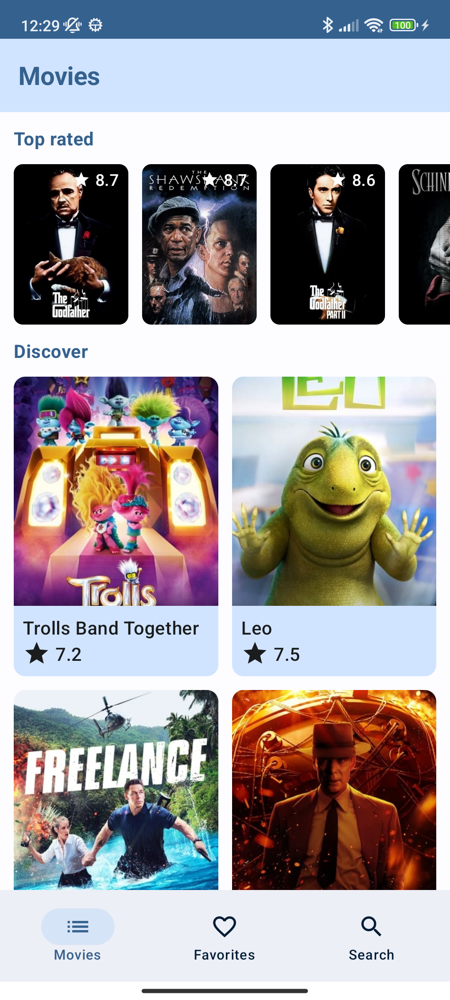
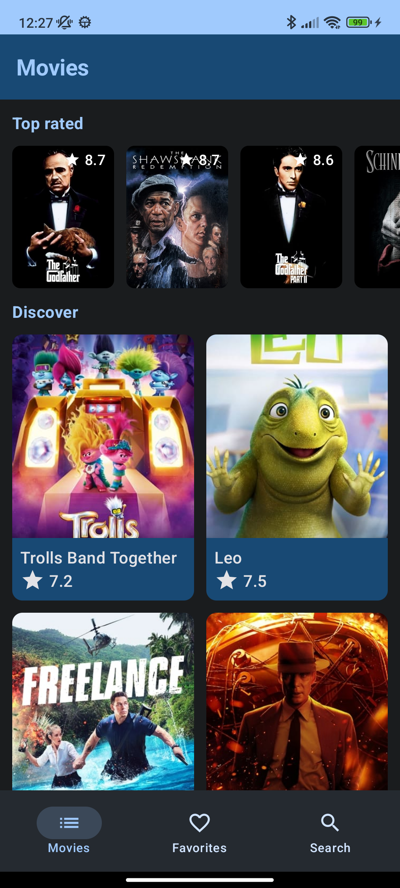
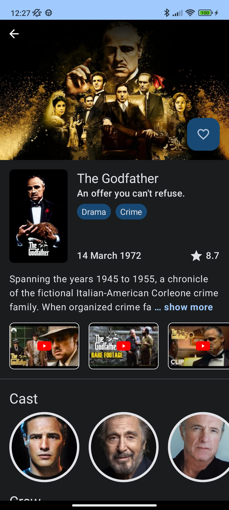

# Movies

🎬 Repository to show an example of Compose with Compose navigation, Paging 3, testing and some
android technologies.

### Design 🎨

- Light mode

 
 
 

- Dark mode

 
 
 

### 🏗️ Architecture
- Clean architecture
- Single Activity
- MVVM

### 💻 Tech Stack

- Kotlin
- Compose & Compose navigation
- ViewModel
- Coroutines & Flow
- Hilt
- Paging 3
- Glide
- Retrofit & OkHttp

### 🐛 Testing

- MockK
- Hilt testing
- Paging testing

[TMDB](https://www.themoviedb.org/)
